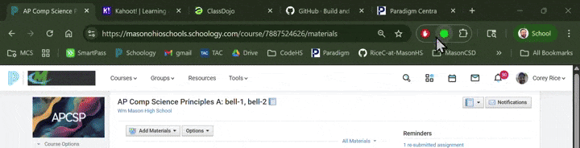

# Project: "SB29-guard-chrome" - DPA Status Checker Chrome Extension

## Mission: The "Why"
Our goal is to build a simple, privacy-first tool that empowers teachers to make safe choices about digital resources. In an instant, they should know if a website they are visiting respects student data privacy according to our district's standards (Ohio SB29).

This isn't about blocking the internet; it's about providing a gentle, informative nudge in the right direction. We're building a guardian for student data, one browser tab at a time.

## Core Principles
This project is guided by three core beliefs. Everything we build must align with these:

1. **Zero Data Collection.** We are fundamentally committed to privacy. The extension must not transmit user browsing history or any PII to any server, ever. Our architecture will reflect this. We trust our teachers, and they need to be able to trust our tool completely.

2. **Keep It Simple.** This extension has one job: display the DPA status of the current website. No feature creep. No bloat. It should be lightweight, fast, and almost invisible until it's needed.

3. **Frictionless for Teachers.** The experience should be seamless.  It needs to just work with no logins or complex setup.

## Project Status & Technical Details
This repository contains the full source code and planning documents for the extension. For a detailed breakdown of the technical architecture, feature set, and phased rollout plan, please see our [Technical Plan](requirements/technical-plan.md).

## ⚙️ Configuration Guide

This extension is designed to be agnostic of the specific school district. To use it, you must configure it with your district's specific data sources.

1. Prepare Your Data

    You need a Google Sheet containing your approved software list.

    * Structure: See [google-sheets-data-structure.md](requirements/google-sheets-data-structure.md) for the required column headers (e.g., `software_name`, `hostname`, `current_tl_status`, etc.). A template is provided in [`example.csv`](requirements/example.csv).

    * Publishing the DPA list (School Admins):

        1. In your Google Sheet, go to File > Share > Publish to web.

        2. Select the specific sheet (tab) you want to use.

        3. Change the format dropdown from "Web page" to Comma-separated values (.csv).

        4. Click Publish and copy the generated link.

2.  Configure the Extension (All Users):

    1. Right-click the SB29 Guard extension icon in your browser toolbar and select Options.

    2. District Data Source (CSV URL): Paste the CSV link you copied in step 1.

    3. Teacher Request Form URL (Optional): Paste the link to your district's Google Form where teachers can request reviews for new software.

    4. Click Save Configuration.

    The extension will now fetch your specific data and cache it locally.